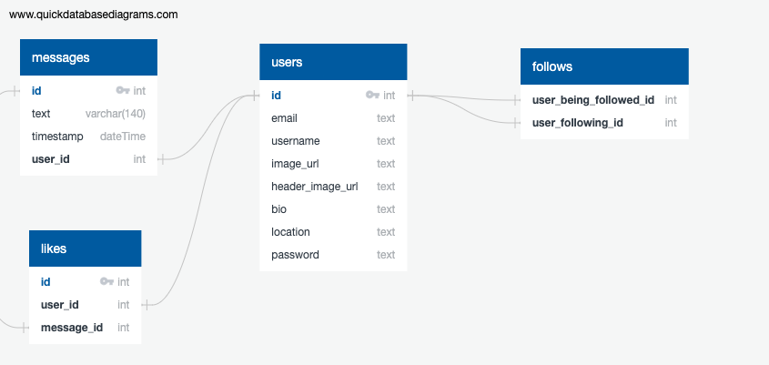

# Warbler Project

A Twitter clone project!


Create an account, add a user, edit profile, follow people, and more.

This app uses [Flask Python](https://flask.palletsprojects.com/) as our backend framework, [PostgreSQL](https://www.postgresql.org/) for database storage, and HTML / CSS to render the front-end.

-   [Try This App!](#try-this-app)
-   [Database Overview](#database-overview)
-   [How to Install and Run This Project Locally](#how-to-install-and-run-this-project-locally)
-   [How to Use This project](#how-to-use-this-project)
    -   [Sign up for an Account](#sign-up-for-an-account)
    -   [Profile Page](#profile-page)
    -   [Follow a Warbler Account](#follow-a-warbler-account)
    -   [View All Posted Messages](#view-all-posted-messages)
    -   [Logging Out](#logging-out)
-   [Running Tests](#running-tests)
-   [Known Bugs](#known-bugs)

## Try This App!
To try this app, [visit the demo site here](http://tonyalvarez-twitter-clone-webapp-1.azurewebsites.net).

## Database Overview


## How to Install and Run This Project Locally

Before you install this package, please make sure to start your local database server. This will ensure that the command below creates the proper database.

To build this project locally, copy/paste this command:

```console
python3 -m venv venv
source venv/bin/activate
pip install -r requirements.txt
createdb warbler
python seed.py
flask run
```

This will create a local Python virtual environment, set up your database with the provided `seed.py` file, and start your flask server.

## Deploying this project
To deploy this project to Github Actions, create a `*.yaml` file with deployment configurations.

You can see how to deploy to Github Actions [here](https://docs.github.com/en/actions/using-workflows/workflow-syntax-for-github-actions).

#

## How to Use This project

A brief video walkthrough of this app:

[](https://user-images.githubusercontent.com/20695616/174462301-f0b4c818-b06c-41bb-8294-b8996f7466b7.mp4)


To view this project, run `localhost` on your computer.

### Sign up for an Account

On the homepage, click on "Sign Up" to create an account.


### Profile page

On successful account creation, you'll be taken to your feed page.


It will empty, so let's follow some accounts!

### Follow A Warbler Account

To view all accounts on the app, go to the [Users](https://localhost:5000/users) page.


Click "Follow" on any account you'd like, and that account will now be shown in your Following page.


### View All Posted Messages

In your homepage, you'll now see all the messages that your following accounts post:


### Write a New Message

To write a new message from your account, click on "New Message" in the upper right corner or visit the [New Message](http://localhost:5000/messages/new) url:


You'll now see your message posted in your profile's feed:


### Logging Out

To log out, simply click on "Log Out" in the nav bar, or visit the [Log Out](https://localhost:5000/logout) url.

You'll then be redirected to the app homepage, with a message confirming that you've been logged out.


#

## Running Tests

There are 4 test files in this application:

-   _test_message_model.py_
    -   Tests the `message` model that stores message data
-   _test_message_view.py_
    -   Tests the `message` view that renders data to the front end
-   _test_user_model.py_
    -   Tests the `user` model that stores user data
-   _test_user_view.py_
    -   Tests the `user` view that renders user data to the front end

To run tests, run:

```console
python -m unittest
```

This will run a total of 51 tests.

#

## Known Bugs

-   unittest for edit profile is not working properly

#

MIT License

Copyright (c) [year] [fullname]

Permission is hereby granted, free of charge, to any person obtaining a copy
of this software and associated documentation files (the "Software"), to deal
in the Software without restriction, including without limitation the rights
to use, copy, modify, merge, publish, distribute, sublicense, and/or sell
copies of the Software, and to permit persons to whom the Software is
furnished to do so, subject to the following conditions:

The above copyright notice and this permission notice shall be included in all
copies or substantial portions of the Software.

THE SOFTWARE IS PROVIDED "AS IS", WITHOUT WARRANTY OF ANY KIND, EXPRESS OR
IMPLIED, INCLUDING BUT NOT LIMITED TO THE WARRANTIES OF MERCHANTABILITY,
FITNESS FOR A PARTICULAR PURPOSE AND NONINFRINGEMENT. IN NO EVENT SHALL THE
AUTHORS OR COPYRIGHT HOLDERS BE LIABLE FOR ANY CLAIM, DAMAGES OR OTHER
LIABILITY, WHETHER IN AN ACTION OF CONTRACT, TORT OR OTHERWISE, ARISING FROM,
OUT OF OR IN CONNECTION WITH THE SOFTWARE OR THE USE OR OTHER DEALINGS IN THE
SOFTWARE.
